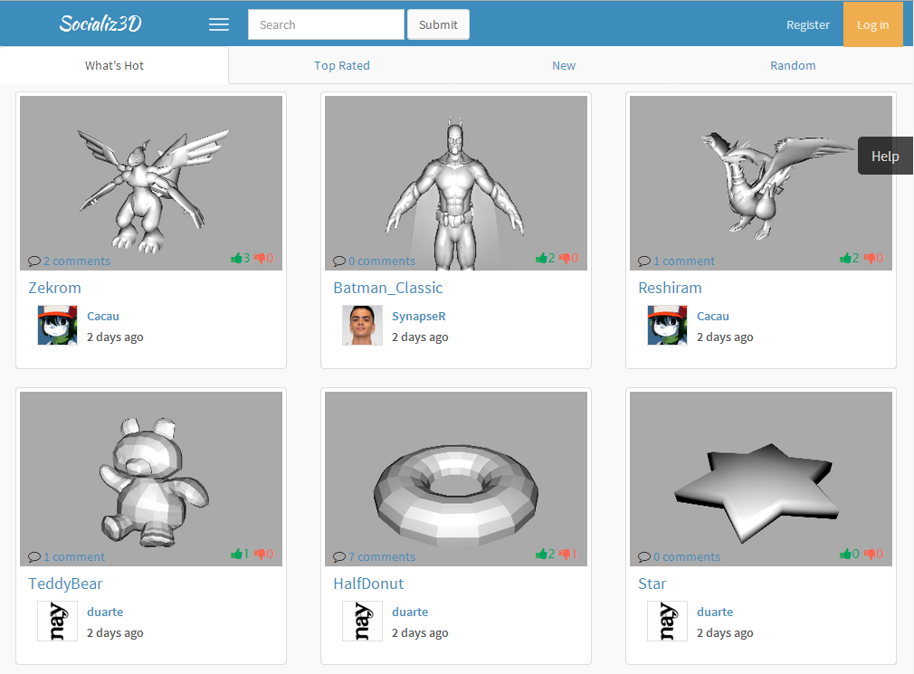

feup-lbaw-2014
==============

Socializ3D
==============

A social platform for 3D designers and aficionados that allows real time visualization of 3D models. A place where one can upload 3d models and share them with others, as well as explore other's creations and rate or share an opinion about them. A user can manage their online portfolio and befriend other users as well as create groups of interests of like-minded artists to collaborate, publicly or privately.

Create
==============

Share
==============

Explore
==============

Development
==============
Socializ3D was developed using PHP and the Smarty template engine.
